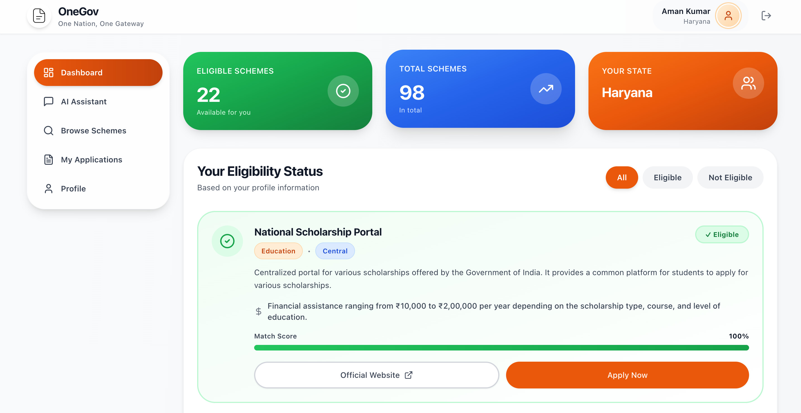

# OneGov

**Live Project Links:**

- 🌐 **Live Link - ** [https://buildsbyaman-onegov.vercel.app](https://buildsbyaman-onegov.vercel.app)

A unified portal for discovering and applying to government schemes in India. OneGov helps users check eligibility, track applications, and interact with an AI assistant for guidance.



## Features

- **Browse Schemes:** Search and filter government schemes by category, eligibility, and state.
- **Eligibility Dashboard:** Instantly check which schemes you qualify for based on your profile.
- **Application Tracker:** Track the status of your applications in one place.
- **Profile Management:** Edit and update your personal and document details.
- **AI Assistant:** Get instant answers and personalized scheme suggestions.
- **Secure Auth:** Sign up, log in, and manage your account securely.

## Tech Stack

- **Frontend:** React, TypeScript, Tailwind CSS, Vite
- **Backend:** Node.js, Express, MongoDB
- **AI:** Integrated assistant for user queries

## Folder Structure

```
OneGov/
├── server/           # Express backend
├── src/              # React frontend
├── public/           # Static assets
├── favicon.png       # App logo/favicon
├── .env.example      # Example environment config
├── package.json      # Project metadata
└── ...
```
